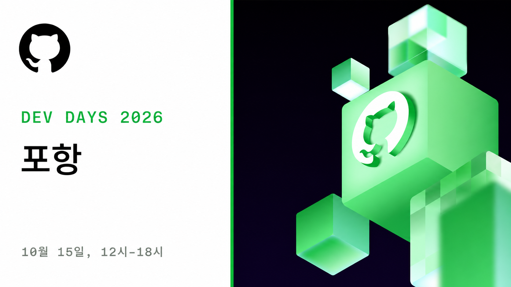

# GitHub Copilot Dev Days 포항

**GitHub Copilot app과 GitHub Copilot CLI를 깊이 있게 살펴보는 실전 워크샵**

- 일정: 2026년 10월 15일 (목)
- 시간: 12:00 - 18:00
- 장소: 포항 일대 (상세 장소 추후 공지)

## 이런 분들을 위한 행사입니다

### AI 코딩을 처음 시작하는 분

GitHub Copilot app과 CLI 사용법을 기초부터 차근차근 익히고, 실제 개발 흐름에 바로 적용해 봅니다.

### 업무 효율을 높이고 싶은 분

최신 AI 보조 개발 기능과 활용 팁으로 나만의 개발 생산성을 한 단계 끌어올립니다.

### 커뮤니티와 연결되고 싶은 분

포항 지역 개발자, 학생들과 함께 경험을 나누고 네트워킹하는 시간을 가집니다.

## 키노트

### 키노트 스피커 추후 공지

스피커와 발표 주제가 확정되는 대로 업데이트됩니다.

## 시간표

세부 내용은 확정되는 대로 업데이트됩니다.

| 시간    | 내용                                              |
| ------- | ------------------------------------------------- |
| 12:00 - | 체크인                                            |
| -       | 오프닝 키노트                                     |
| -       | 워크샵 (GitHub Copilot app 및 GitHub Copilot CLI) |
| - 18:00 | 클로징                                            |

## 세션 소개

이번 Dev Days에서는 두 가지 GitHub Copilot 경험에 집중합니다.

### GitHub Copilot app

데스크탑 앱인 GitHub Copilot app과 함께 작업하며 개발 흐름을 확장하는 방법을 살펴봅니다.

### GitHub Copilot CLI

터미널에서 Copilot을 활용해 일상적인 개발 작업을 더 빠르고 자연스럽게 수행하는 방법을 살펴봅니다.

상세 세션과 연사 정보는 추후 공개됩니다.

## 행사 안내

- 장소: 포항 일대 (상세 주소 추후 공지)
- 대상: 학생, 개발자, AI 코딩에 관심 있는 누구나
- 주차: 별도 주차 지원 없음 — 대중교통 이용 권장
- 문의: matdaaiga@outlook.com

## 지금 바로 신청하세요
